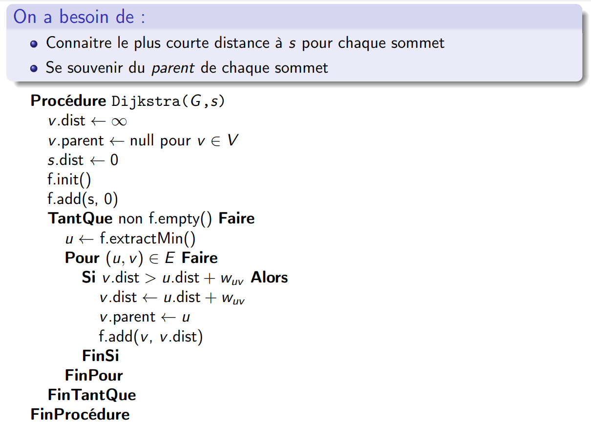
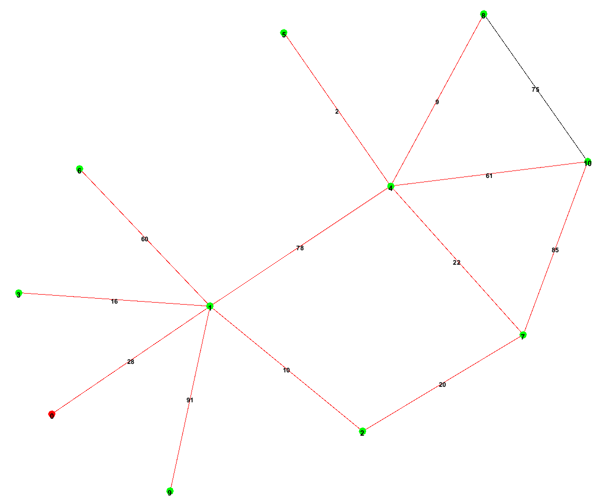
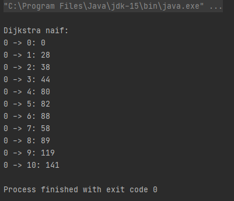
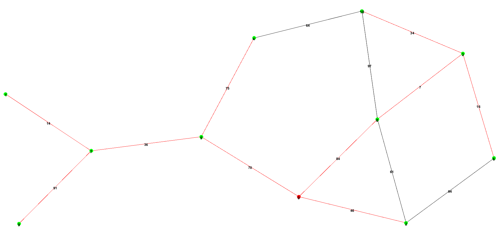
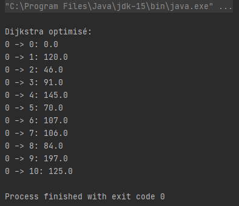

# TP n°3: Les plus courts chemins

***

# Rapport de BOURGEAUX Maxence, Groupe 1 Master 1 IWOCS

***

## Introduction

Ce TP consiste à étudier les différents générateurs aléatoires de graphe proposé par GraphStream, et de mesurer 
l'efficacité de plusieurs algorithmes de Dijkstra sur ces graphes.

Nous allons commencer par consulter la documentation de RandomGenerator qui est une classe de la librairie Graph Stream.
Cette librairie propose aussi un algorithme de Dijkstra très efficace, que nous allons tester sur des graphes aléatoirement
générés par RandomGenerator, puis comparer ces résultats avec une implémentation naïve de l'algorithme de Dijsktra.

Pour cela plusieurs critères de tests seront définis par la suite. Les résultats de ces tests sont consutables dans le 
fichier ficherResultat.dat.

Je tiens aussi à préciser que j'utilise la version 2.0 de GraphStream, et que les tests seront effectués sur mon ordinateur
personnel doté d'un processeur Intel i5-9300H 2.40 GHz.

***

## Question 1. Commencez par décrire le générateur que vous avez utilisé et ses paramètres.

Ce programme utilise le RandomGenerator proposé par Graph Stream. Il nous permet de générer des graphes aléatoires selon
un nombre de noeuds (nbNode) et un degré moyen (degree) passés en arguments dans le constructeur.
Voici son implémentation:

```java
public class MainRandomGenerator {
    private final Graph graph;
    private final int random = 100;

    /** Génère le Random Graph selon le nombre de noeuds et le degré moyen donnés en argument */
    public MainRandomGenerator(int nbNode, int degree) {
        this.graph = new SingleGraph("RandomGenerator");
        this.graph.setAttribute("ui.stylesheet", "url('./src/main/resources/style.css')");

        Generator gen = new RandomGenerator(degree);
        gen.addSink(this.graph);
        gen.begin();
        /* i = 1 et nbNode - 1, sinon je me retrouvais avec deux nodes en plus, sans savoir pourquoi ? */
        for (int i = 1; i < nbNode - 1; i++)
            gen.nextEvents();
        gen.end();
    }
}
```

J'utilise une feuille de style css pour améliorer la visibilité lorsque le graphe est affiché. Les noeuds seront de 
couleur verte.

RandomGenerator fonctionne de la manière suivante:

Premièrement, on appel begin(), qui va créer un noeud unique dans le graphe. Puis, à chaque appel de gen.nextEvents() via
une boucle, le programme va ajouter un noeud dans le graphe et le connecter de manière aléatoire aux autres noeuds. Avec
nbNode, on peut donc choisir le nombre de noeuds total du graphe. Le degré moyen du graphe est déterminé lors de la
création du générateur: Generator gen = new RandomGenerator(degree);

J'attribue ensuite un poids aléatoire à chaque arêtes du graphe et les affiche, puis j'affiche avec les noeuds:

```java
/* Ajoute un poids random à chaque arête du graphe random généré */
this.graph.edges().forEach(e -> {
    int r = (int) (Math.random() * random) + 1;
    e.setAttribute("length", r);
    e.setAttribute("ui.label", e.getAttribute("length"));
});

/* Ajoute le nom des noeuds du graphe random généré */
for (Node v : this.graph)
    v.setAttribute("ui.label", v.getId());
```

On peut remarquer qu'ici, le graphe aura des arêtes avec un poids aléatoire de 1 à 100. Pour augmenter ou diminuer ce 
poids, il faudra simplement changer la valeur de random.

***

## Question 2. Décrivez l'algorithme que vous avez implémenté et testé.

Voici l'algorithme de Dijkstra vu en cours (diapositive n°9):



En reprenant cet algorithme, je suis parvenu à créer une méthode DijkstraNaif qui est la suivante:

```java
/** Version naïve de Dijkstra selon l'algorithme vu en cours */
public void DijkstraNaif(Node source) {
    /* Liste de priorité des noeuds, chaque noeud du graphe sera associé à une valeur définissant sa priorité */
    Map<Node, Integer> map = new HashMap<>();

    /* Debut de l'algorithme. Tous les noeuds possèdent une priorité négative et une distance égale à infini car
       les noeuds n'ont pas encore été parcouru (distance encore inconnue) */
    for (Node node : this.graph)
        node.setAttribute("result", "Infinity");

    /* Noeud source qui est à une distance 0 */
    source.setAttribute("result", 0);

    /* On insère source dans la map */
    map.put(source, (Integer) source.getAttribute("result"));

    while (!map.isEmpty()) {
        Node u = null;

        /* Début de ExtractMin() qui va trouver la plus petite valeur de priorité stockée dans la map */
        for (Map.Entry<Node, Integer> entry : map.entrySet())
            u = entry.getKey();
        /* On retire le noeud de priorité minimal de la map */
        map.remove(u);
        /* Fin de ExtractMin() */

        /* Pour chaque noeud voisin v du noeud u, on va regarder si dist(source, v) > dist(source, u) + dist(u, v) */
        for (Edge v : u) {
            int x = (int) u.getAttribute("result");
            int y = (int) v.getAttribute("length");

            /* Si v n'a jamais été visité, alors sa distance est égale à infini, donc v = dist(source, u) + dist(u, v) */
            if (v.getOpposite(u).getAttribute("result").equals("Infinity")) {
                v.getOpposite(u).setAttribute("result", (x + y));
                v.getOpposite(u).setAttribute("parent", u);
                /* Ajout de v et de sa priorité dans la map */
                map.put(v.getOpposite(u), (Integer) v.getOpposite(u).getAttribute("result"));
                /* Colorie en rouge les arêtes des plus courts chemins du graphe */
                v.setAttribute("ui.style", "fill-color: red;");

            /* Sinon, v possède déjà une distance, donc on la compare avec dist(source, u) + dist(u, v) */
            } else {
                int z = (int) v.getOpposite(u).getAttribute("result");
                if (z > x + y) {
                    v.getOpposite(u).setAttribute("result", (x + y));
                    v.getOpposite(u).setAttribute("parent", u);
                    map.put(v.getOpposite(u), (Integer) v.getOpposite(u).getAttribute("result"));
                    /* Colorie en rouge les arêtes des plus courts chemins du graphe */
                    v.setAttribute("ui.style", "fill-color: red;");
                }
            }
        }
    }
    /* Affiche le résultat du calcul des plus courts chemins de la source jusqu'à chaque noeud du graphe */
    System.out.println("\nDijkstra naif:");
    for (Node node : graph)
        System.out.printf("%s -> %s: %s%n", source.getId(), node.getId(), node.getAttribute("result"));

    /* Affiche le noeud source en rouge */
    source.setAttribute("ui.style", "fill-color: red;");
}
```

Cette version de l'algorithme de Dijkstra est en complexité: O[n²] car la map n'est pas triée (sinon O[nm]).
J'utilise une HashMap pour stocker l'ordre de priorité, c'est à dire la distance entre chaque noeud par rapport au noeud
source s.
Cette map stock des objets de type <Node, Integer>. Ici Node fait référence au noeud en question, et Integer à sa
priorité / sa distance. Cette map est tout simplement la file f vu en cours.

Comme dans l'algorithme du cours, nous commençons par remplir cette map par le noeud source s. Tant que notre map n'est
pas vide, l'algorithme va extraire le noeud de priorité minimal, puis va chercher les voisins proches de ce noeud.
Si ces noeuds possèdent une distance, par rapport au noeud source, supérieure à celle du noeud courrant, alors la distance
est mise à jour. De même si le noeud voisin possède une distance infinie, c'est à dire qu'il n'a pas encore été visité.
Ces deux cas ajoutent le noeud voisin à la file, c'est à dire dans notre map.

L'algorithme termine par afficher dans le terminal les plus courts chemins du noeud source à tous les autres noeuds.

Côté visuel, l'algorithme propose de colorier en rouge le noeud source, ainsi que les arêtes des plus courts chemins.

Voici un test de l'algorithme de Dijkstra naïf, avec 10 noeuds de degré moyen égal à 2:






***

## Question 3. Décrivez l'algorithme avec lequel vous le comparez (la version de Dijkstra de GraphStream).

Voici l'algorithme proposé par la documentation de GraphStream:

```java
/** Version optimisée de Dijkstra disponible dans la doc de GraphStream, avec quelques fonctionnalités visuelles supplémentaires */
public void Dijkstra(Node source) {
    this.graph.setAttribute("ui.stylesheet", "url('./src/main/resources/style.css')");
    Dijkstra dijkstra = new Dijkstra(Dijkstra.Element.EDGE, "result", "length");

    /* Calcule les plus courts chemins de la source jusqu'à chaque noeud du graphe */
    dijkstra.init(this.graph);
    dijkstra.setSource(this.graph.getNode(source.getId()));
    dijkstra.compute();

    /* Affiche le résultat du calcul des plus courts chemins de la source jusqu'à chaque noeud du graphe */
    System.out.println("\nDijkstra optimisé:");
    for (Node node : this.graph)
        System.out.printf("%s -> %s: %s%n", dijkstra.getSource(), node, dijkstra.getPathLength(node));

    /* Colorie en rouge les arêtes des plus courts chemins du graphe */
    for (Edge edge : dijkstra.getTreeEdges())
        edge.setAttribute("ui.style", "fill-color: red;");

    /* Affiche le noeud source en rouge */
    source.setAttribute("ui.style", "fill-color: red;");
}
```

D'après la documentation, cet algorithme utilise en interne le "Fibonacci Heap", une structure de données qui lui permet
de s'exécuter plus rapidement pour des graphiques de très grande taille. Ce tas de Fibonacci permet de diminuer de
manière très significative le temps d'exécution du programme dès lors que le graphe créé est grand. Pour des graphes de
petite taille / de taille normale, la différence de temps d'exécution n'est pas significative.

D'après le cours, la complexité d'un tas de Fibonacci est de O[n log n + m].

La différence de complexité entre l'implémentation naïve et celle optimisée est la suivante (exemple du cours). Soit un graphe où n = 1000 
et m = 10 000:
* Implémentation naïve: ≈ 1 000 000 opérations
* Implémentation efficace: ≈ 20 000 opérations

Différence → 50 fois plus rapide.

Voici un test de l'algorithme de Dijkstra optimisé, avec 10 noeuds de degré moyen égal à 2:




***

## Question 4. Décrivez les tests que vous avez fait en justifiant les choix que vous avez fait.

Passons maintenant à la phase de tests.